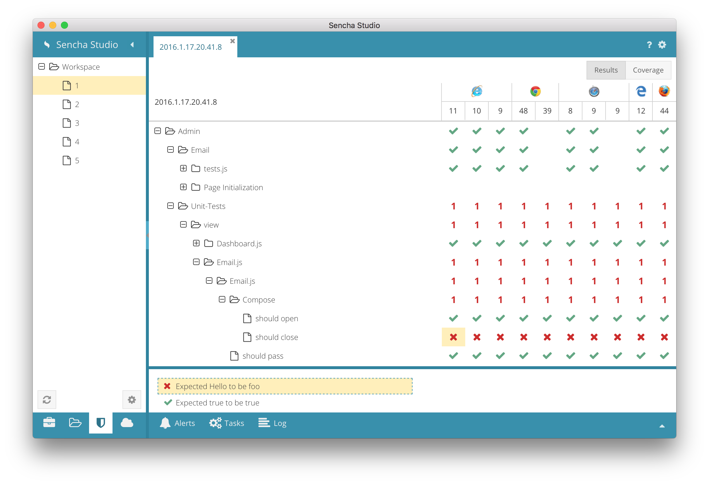
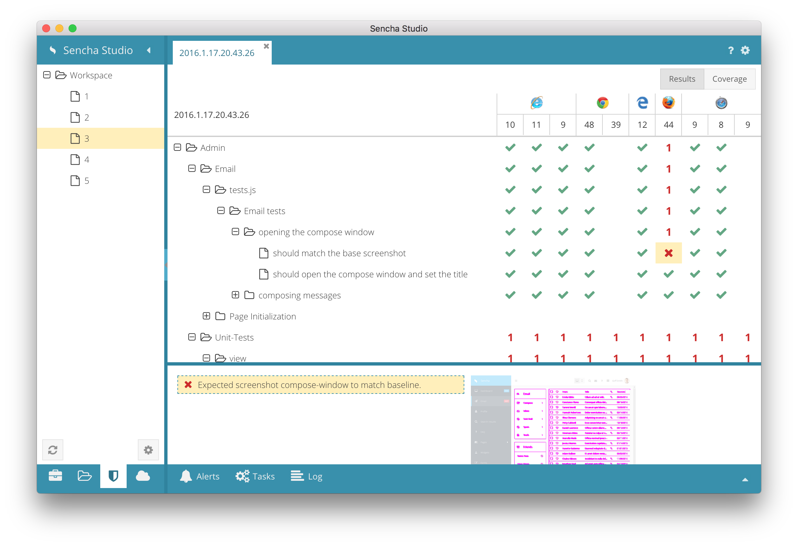
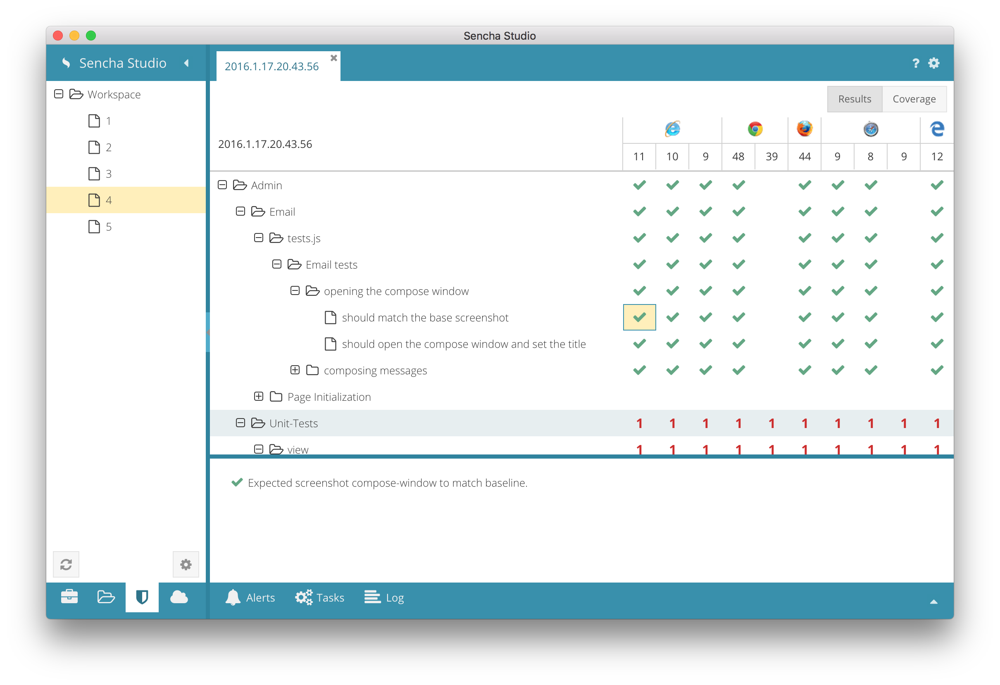
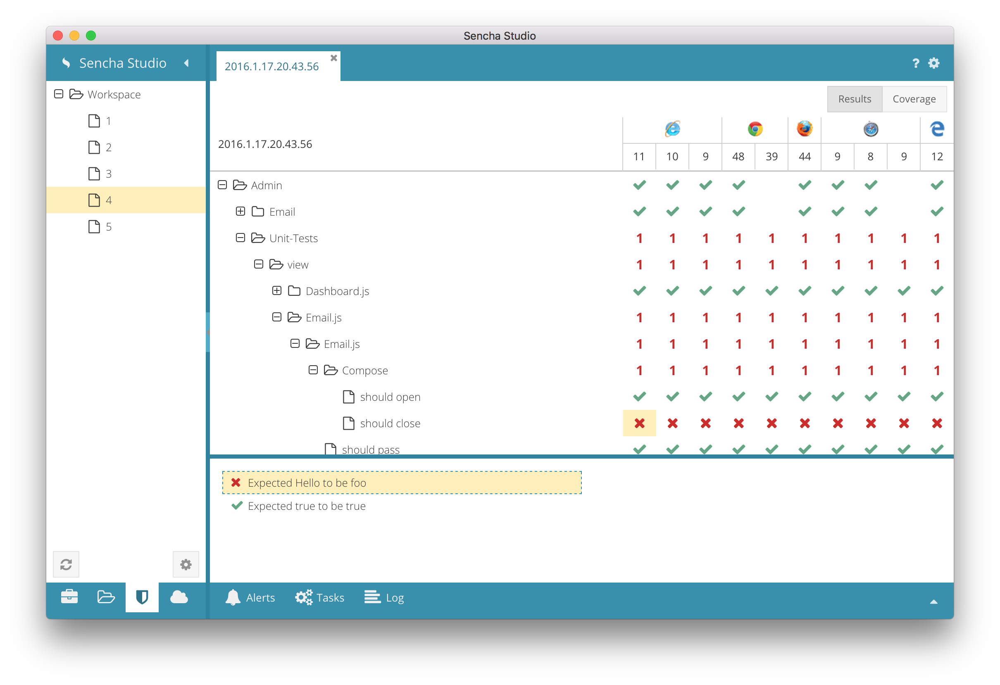
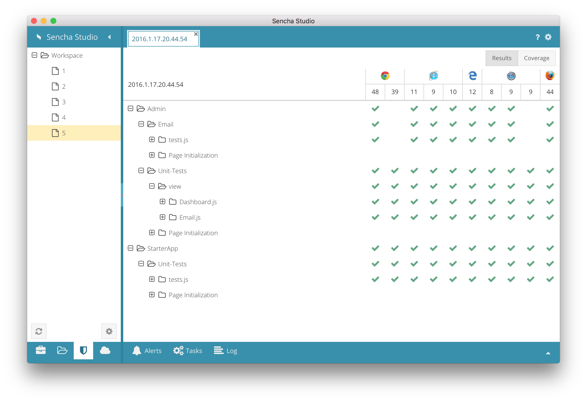

# Sencha Test - Workspace Demo Walkthrough

The test runs for the Workspace sub-project illustrate several common situations when running
tests using Sencha Test.

## Test Run #1
In the first test run there is a single failing test. This run establishes the **screenshot**
baselines to which subsequent test runs are compared.

## Test Run #2
In the second test run a problem appears in the Email screen. All of the components are shifted
by some small amount. We can see this difference in the thumbnail by selecting the failing test
cell and then the expectation in the details area.

## Test Run #3
The visual problems are fixed on all browsers. Except Firefox.

## Test Run #4
Now the visual problems are all fixed. Even on Firefox.

But there is still that failing test that goes back to Run #1. Clicking the cell to reveal the
details shows us that the text is off.

## Test Run #5
Finally - all tests pass on all browsers!

